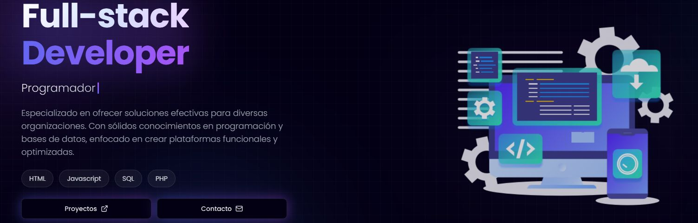

<h1 align="center">Hola 👋, Soy Jaume Crespo</h1>
<h3 align="center">Apasionado de la programación</h3>

  

- 📫 Me puedes contactar en **jaumecrespo@jaumecrespo.com**

<h3 align="left"> www.jaumecrespo.com</h3>

<h3 align="left">Languages and Tools:</h3>

  

### ⚙️ &nbsp;GitHub Analytics

